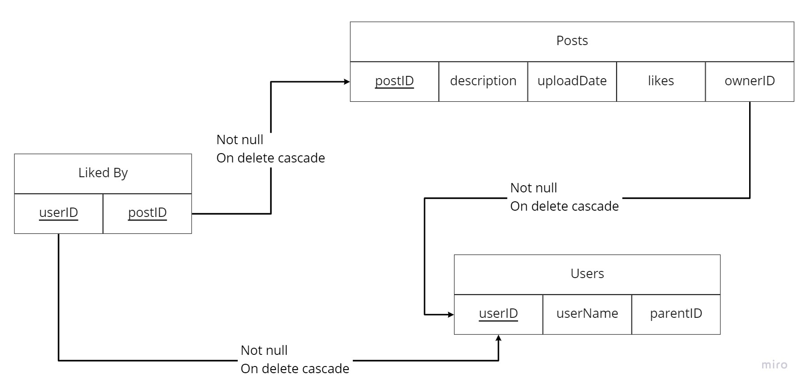

# Mighty Block Challenge by Juan De Luca

## Index

In this readme you will find the following items:
1. Task
1. Database
1. Setup
1. Execution

## 1. Task

The task to this challenge can be found [here](./task/task.pdf) or in the file called _task.pdf_ inside the _task_ directory of this repository.

## 2. Database

The chosen database was PostgreSQL but without the use of the _sequelize_ tool. PostgreSQL was chosen before a more widely used DB like Mongo because the knowledge of the author about PostgreSQL was greater than that about Mongo, and the decision to not use the _sequelize_ tool was merely out of simplicity, given that the complexity of this database didn't make its usage necesary.
The Database Schema used was the following:

There are 2 data tables (Posts and Users) and one relation table (Liked By).
The _Posts_ table has 5 columns, of which _postID_ is the PK and _ownerID_ is a FK that references the PK of the table _Users_ and it noted with "Not Null On Delete Cascade" which means that if the owner of this post is deleted, then the post itself will be deleted.
The _Users_ table has 3 columns of which _userID_ is the PK.
Lastly, the _Liked By_ table has 2 columns, where _postID_ is a FK that references the PK of the table _Users_, and _postID_ is a FK that references the PK of the table _Posts_, which makes that if a user or a post is deleted, then the entry that relates these two will be deleted. Both these FKs combined form the PK for this table, as to prevent that a single user can like the same post twice.

## 3. Setup

### a. Setup with docker-compose

Located in the root of the project, execute the following command in a command line:

```
$ docker-compose up -d
```

This will locally create two images. To check this you can run:

```
$ docker ps
```

Next, run:

```
$ docker exec -it postgresql_mblock_challenge bash
```

This will enter the command line of the docker container. From here, you should enter the PostgreSQL terminal and then enter the database of this project and start populating it, by running the following commands:

```
/# psql -U postgres
```

```
postgres=# \c mblock_api_db
```

Now, to populate the DB, you should run every query found in the _database.sql_ file separately:

```
mblock_api_db=# CREATE TABLE users (
    userID SERIAL PRIMARY KEY,
    userName VARCHAR(15) UNIQUE NOT NULL,
    parentID INT
);
```

```
mblock_api_db=# INSERT INTO users(userName, parentID) VALUES ('johndoe', NULL);
```

```
mblock_api_db=# INSERT INTO users(userName, parentID) VALUES ('janedoe', 1);
```

```
mblock_api_db=# INSERT INTO users(userName, parentID) VALUES ('johndoejr', 1);
```

```
mblock_api_db=# CREATE TABLE posts (
    postID SERIAL PRIMARY KEY,
    descr VARCHAR(280),
    uploadDate DATE NOT NULL,
    likes INT NOT NULL,
    ownerID INT NOT NULL REFERENCES Users
);
```

```
mblock_api_db=# CREATE TABLE likedBy (
    userID INT NOT NULL REFERENCES Users,
    postID INT NOT NULL REFERENCES Posts,
    PRIMARY KEY(userID, postID)
);
```

Now, the DB is fully populated and you are ready to jump to the execution.

### b. Local Setup

For this, you should first have installed PostgreSQL in your computer.
After that you should create a database inside your PostgreSQL called "mblock_api_db".
Then you should change the "host" attribute of the _db.js_ file found inside the "db" directory, from "postgresqls" to "localhost".
Now, run:


```
$ psql -U postgres
```

Enter your PostgreSQL password and then follow the same steps as in the previous item to create the tables and populate them.
Once you have created and populated the tables, run:

```
$ npm start
```

## 4. Execution

Be it if you set the project up locally or with docker-compose, the API now should be running in port 3000 of your computer. If not, it may be because of your environment variables setting and you might need to change the "ports" attribute of the "node" object inside the _docker-compose.yml_ file to the correct port, this being if you set up the project with the docker-compose command.
Now, you can start playing with the endpoints of the API, which are the following:

### GET

* http://localhost:3000/api/users (gets all the users in the DB)
* http://localhost:3000/api/posts (gets all the posts in the DB)
* http://localhost:3000/api/users/:userID (gets a user given its ID)
* http://localhost:3000/api/posts/:postID (gets a post given its ID)

### POST

* http://localhost:3000/api/posts (creates a new post). The way of using it is by sending a description and the ID of the post owner by sending the following POST request:

```
{
	"descr": "example",
	"ownerID": 2
}
```

For this to work, the ID of the owner must be one that already exists in the _Users_ table

### PUT

* http://localhost:3000/api/posts/:postID (likes or dislikes a post given its ID). The way of using it is by sending a PUT request like one of the following:

```
{
	"userID": 1,
	"status": "liked"
}
```

```
{
	"userID": 2,
	"status": "disliked"
}
```

For this to work, the ID of the user and the ID of the post both must already exist in the _Users_ and _Posts_ tables respectively, and a user liking must not have previously liked the post and a user disliking must have previously liked the post.